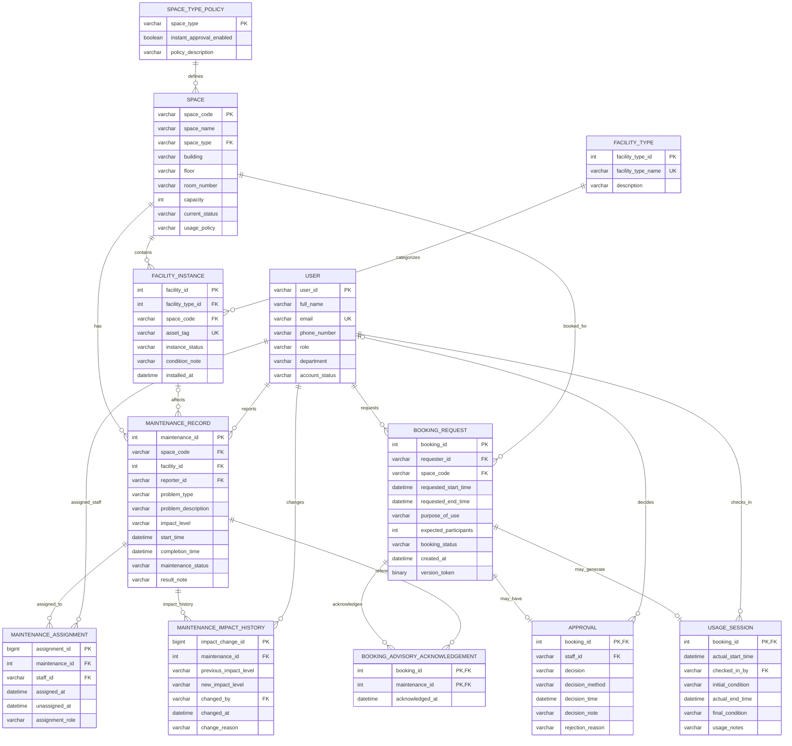

# 09. Updated ERD and Logical Design – Group G10

## 1. Introduction

Phase 2 extends the Campus Space Management System designed in Phase 1.

The updated design must support the new operating requirements while preserving the core entities and historical data from Phase 1.

The main design changes are:

1. Introduce configurable instant approval policies for different space types.
2. Distinguish physical facility types from individual facility instances.
3. Support both staff approval and automatic approval.
4. Add a concurrency token to booking requests.
5. Distinguish maintenance impact levels:
   - `advisory`
   - `out-of-service`
6. Preserve maintenance assignment history.
7. Preserve maintenance impact-level change history.
8. Store acknowledgement when a requester is informed about advisory maintenance.
9. Support identifying approved bookings affected by maintenance escalation.

The following sections present the finalized Phase 2 ERD and relational logical design.

---

# 2. Updated Entity-Relationship Diagram

The finalized Phase 2 ERD is shown below.



---

# 3. Entity Changes from Phase 1

## 3.1. USER

`USER` remains the central entity representing users of the campus space management system.

No major structural change is required in Phase 2.

Attributes:

- `user_id`: unique identifier of a university user.
- `full_name`: full name of the user.
- `email`: university email address.
- `phone_number`: contact phone number.
- `role`: role of the user.
- `department`: department of the user.
- `account_status`: current status of the account.

Candidate key:

```text
email
```

Primary key:

```text
user_id
```

Users may act as:

- booking requesters;
- approval staff;
- check-in staff;
- maintenance reporters;
- maintenance assignees;
- maintenance impact changers.

---

# 4. SPACE_TYPE_POLICY

`SPACE_TYPE_POLICY` is introduced in Phase 2 to configure booking behavior by space type.

Instead of embedding instant-approval configuration directly into every space, the configuration is stored once for each `space_type`.

Attributes:

- `space_type`: identifies a category of spaces.
- `instant_approval_enabled`: indicates whether bookings for this space type may be automatically approved.
- `policy_description`: descriptive information about the policy.

Primary key:

```text
space_type
```

Relationship:

```text
SPACE_TYPE_POLICY 1 ---- N SPACE
```

A space type policy may define the policy for many spaces.

Each space belongs to one space type policy.

This design avoids storing the same instant approval setting repeatedly for every space of the same type.

---

# 5. SPACE

`SPACE` represents physical spaces that may be booked.

Attributes:

- `space_code`
- `space_name`
- `space_type`
- `building`
- `floor`
- `room_number`
- `capacity`
- `current_status`
- `usage_policy`

Primary key:

```text
space_code
```

Candidate key:

```text
(building, floor, room_number)
```

This candidate key is preserved from Phase 1 and ensures that one physical room
location identifies at most one space.

Foreign key:

```text
space_type
    -> SPACE_TYPE_POLICY.space_type
```

Important Phase 2 rule:

A space may still have maintenance activity while remaining bookable when the relevant maintenance impact level is `advisory`.

Therefore, availability is no longer determined only from `SPACE.current_status`.

The requested booking interval must also be compared with active maintenance records.

---

# 6. FACILITY_TYPE

Phase 1 represented facilities directly at space level.

Phase 2 separates the concept of a facility category from an individual physical asset.

`FACILITY_TYPE` represents categories such as:

- projector;
- computer;
- microphone;
- whiteboard;
- air conditioner.

Attributes:

- `facility_type_id`
- `facility_type_name`
- `description`

Primary key:

```text
facility_type_id
```

Candidate key:

```text
facility_type_name
```

---

# 7. FACILITY_INSTANCE

`FACILITY_INSTANCE` represents an individual physical facility located inside a space.

For example:

```text
Facility Type:
    Projector

Facility Instances:
    Projector P001 in A101
    Projector P002 in B205
```

Attributes:

- `facility_id`
- `facility_type_id`
- `space_code`
- `asset_tag`
- `instance_status`
- `condition_note`
- `installed_at`

Primary key:

```text
facility_id
```

Candidate key:

```text
asset_tag
```

Foreign keys:

```text
facility_type_id
    -> FACILITY_TYPE.facility_type_id
```

```text
space_code
    -> SPACE.space_code
```

Relationships:

```text
FACILITY_TYPE 1 ---- N FACILITY_INSTANCE
```

and:

```text
SPACE 1 ---- N FACILITY_INSTANCE
```

This model allows maintenance to refer to a specific physical facility instead of only referring to a general facility name.

---

# 8. BOOKING_REQUEST

`BOOKING_REQUEST` stores requests to use campus spaces.

Attributes:

- `booking_id`
- `requester_id`
- `space_code`
- `requested_start_time`
- `requested_end_time`
- `purpose_of_use`
- `expected_participants`
- `booking_status`
- `created_at`
- `version_token`

Primary key:

```text
booking_id
```

Foreign keys:

```text
requester_id
    -> USER.user_id
```

```text
space_code
    -> SPACE.space_code
```

The main Phase 2 addition is:

```text
version_token
```

In the SQL Server implementation, this attribute is represented using `ROWVERSION`.

Its purpose is to detect stale updates to the same booking when multiple users attempt to modify or make a decision on the booking concurrently.

Example:

```text
Staff A reads booking B1.

Staff B changes B1.

Staff A later tries to approve the old version.

The version token has changed, so the stale operation can be rejected.
```

However, `version_token` alone does not solve overlapping booking conflicts between different booking rows.

The concurrency implementation therefore additionally uses transaction-level locking by `space_code`.

---

# 9. APPROVAL

`APPROVAL` records the final approval decision associated with a booking.

Attributes:

- `booking_id`
- `staff_id`
- `decision`
- `decision_method`
- `decision_time`
- `decision_note`
- `rejection_reason`

Primary key:

```text
booking_id
```

Foreign keys:

```text
booking_id
    -> BOOKING_REQUEST.booking_id
```

```text
staff_id
    -> USER.user_id
```

The primary key on `booking_id` ensures that one booking has only one approval decision row.

Phase 2 introduces:

```text
decision_method
```

Possible values include:

```text
automatic
staff
```

For staff approval:

```text
decision_method = staff
staff_id IS NOT NULL
```

For automatic approval:

```text
decision_method = automatic
staff_id IS NULL
```

Automatic decisions can only approve a booking.

A rejection must be performed through the staff workflow and must contain a rejection reason.

Relationship:

```text
BOOKING_REQUEST 1 ---- 0..1 APPROVAL
```

A booking request may have no approval row while it is still pending or when it is
cancelled before a decision is made. Once a final approval or rejection decision is
recorded, at most one `APPROVAL` row can exist because `booking_id` is the primary
key of `APPROVAL`.

The `APPROVAL` entity therefore records both existing manual approval decisions and the new instant approval mechanism.

---

# 10. USAGE_SESSION

`USAGE_SESSION` stores the actual use of an approved booking.

Attributes:

- `booking_id`
- `actual_start_time`
- `checked_in_by`
- `initial_condition`
- `actual_end_time`
- `final_condition`
- `usage_notes`

Primary key:

```text
booking_id
```

Foreign keys:

```text
booking_id
    -> BOOKING_REQUEST.booking_id
```

```text
checked_in_by
    -> USER.user_id
```

Relationship:

```text
BOOKING_REQUEST 1 ---- 0..1 USAGE_SESSION
```

A booking may generate at most one usage session. A usage session exists only when
the booking is actually checked in. Pending, rejected, cancelled, or no-show bookings
may therefore have no `USAGE_SESSION` row.

A usage session records actual check-in, check-out, and condition information associated with a booking.

---

# 11. MAINTENANCE_RECORD

`MAINTENANCE_RECORD` represents a maintenance issue affecting a space or an individual facility instance.

Attributes:

- `maintenance_id`
- `space_code`
- `facility_id`
- `reporter_id`
- `problem_type`
- `problem_description`
- `impact_level`
- `start_time`
- `completion_time`
- `maintenance_status`
- `result_note`

Primary key:

```text
maintenance_id
```

Foreign keys:

```text
space_code
    -> SPACE.space_code
```

```text
(facility_id, space_code)
    -> FACILITY_INSTANCE(facility_id, space_code)
```

```text
reporter_id
    -> USER.user_id
```

`facility_id` may be null when the problem affects the space as a whole rather than one
specific facility instance.

When `facility_id` is provided, the composite referential constraint
`(facility_id, space_code)` ensures that the selected facility instance belongs to the
same space as the maintenance record.

Phase 2 introduces:

```text
impact_level
```

The valid logical values are:

```text
advisory
out-of-service
```

### Advisory

An advisory means that the space remains usable.

Examples:

- one projector is broken;
- one whiteboard is damaged;
- one air conditioner among several is unavailable.

The requester may still book the space but must be informed about the advisory.

### Out-of-service

An out-of-service maintenance record means that the space cannot be booked during the overlapping maintenance interval.

Examples:

- electrical repair;
- floor replacement;
- major infrastructure failure.

Therefore, maintenance availability is based on the combination of:

```text
space_code
impact_level
maintenance_status
start_time
completion_time
```

---

# 12. MAINTENANCE_ASSIGNMENT

Phase 1 stored an assigned staff member directly inside the maintenance record.

Phase 2 separates assignment information into:

```text
MAINTENANCE_ASSIGNMENT
```

Attributes:

- `assignment_id`
- `maintenance_id`
- `staff_id`
- `assigned_at`
- `unassigned_at`
- `assignment_role`

Primary key:

```text
assignment_id
```

Foreign keys:

```text
maintenance_id
    -> MAINTENANCE_RECORD.maintenance_id
```

```text
staff_id
    -> USER.user_id
```

Possible assignment roles include:

```text
primary
support
```

This design supports:

- assignment history;
- staff replacement;
- multiple staff members participating in one maintenance task;
- distinguishing primary and support responsibilities.

Relationship:

```text
MAINTENANCE_RECORD 1 ---- N MAINTENANCE_ASSIGNMENT
```

A user may receive many maintenance assignments.

---

# 13. MAINTENANCE_IMPACT_HISTORY

Phase 2 allows a maintenance record to change impact level while the maintenance task remains open.

For example:

```text
advisory
    ->
out-of-service
```

or:

```text
out-of-service
    ->
advisory
```

The current impact level is stored in:

```text
MAINTENANCE_RECORD.impact_level
```

The history of changes is stored in:

```text
MAINTENANCE_IMPACT_HISTORY
```

Attributes:

- `impact_change_id`
- `maintenance_id`
- `previous_impact_level`
- `new_impact_level`
- `changed_by`
- `changed_at`
- `change_reason`

Primary key:

```text
impact_change_id
```

Foreign keys:

```text
maintenance_id
    -> MAINTENANCE_RECORD.maintenance_id
```

```text
changed_by
    -> USER.user_id
```

Relationship:

```text
MAINTENANCE_RECORD 1 ---- N MAINTENANCE_IMPACT_HISTORY
```

This allows the system to answer questions such as:

- What was the original impact level?
- Who escalated the maintenance?
- When was the maintenance escalated?
- Why was it escalated?
- Was it later downgraded?

---

# 14. BOOKING_ADVISORY_ACKNOWLEDGEMENT

Phase 2 requires the system to notify requesters about active advisory maintenance when a booking is made.

The system must also record that the requester was informed.

This requirement is represented by:

```text
BOOKING_ADVISORY_ACKNOWLEDGEMENT
```

Attributes:

- `booking_id`
- `maintenance_id`
- `acknowledged_at`

Composite primary key:

```text
(booking_id, maintenance_id)
```

Foreign keys:

```text
booking_id
    -> BOOKING_REQUEST.booking_id
```

```text
maintenance_id
    -> MAINTENANCE_RECORD.maintenance_id
```

The relation represents a many-to-many relationship between bookings and advisory maintenance records.

One booking may acknowledge multiple maintenance advisories:

```text
Booking B1
    -> Maintenance M1
    -> Maintenance M2
```

One maintenance advisory may also be acknowledged by multiple bookings:

```text
Maintenance M1
    -> Booking B1
    -> Booking B2
    -> Booking B3
```

The composite primary key prevents duplicate acknowledgement records for the same booking and maintenance record.

---

# 15. Relationship Summary

## 15.1. SPACE_TYPE_POLICY – SPACE

```text
SPACE_TYPE_POLICY 1 : N SPACE
```

One policy can define one space type used by many spaces.

---

## 15.2. SPACE – FACILITY_INSTANCE

```text
SPACE 1 : N FACILITY_INSTANCE
```

One space may contain many physical facility instances.

---

## 15.3. FACILITY_TYPE – FACILITY_INSTANCE

```text
FACILITY_TYPE 1 : N FACILITY_INSTANCE
```

One facility type may classify many facility instances.

---

## 15.4. USER – BOOKING_REQUEST

```text
USER 1 : N BOOKING_REQUEST
```

One user may submit many booking requests.

---

## 15.5. SPACE – BOOKING_REQUEST

```text
SPACE 1 : N BOOKING_REQUEST
```

One space may be referenced by many bookings over time.

---

## 15.6. BOOKING_REQUEST – APPROVAL

```text
BOOKING_REQUEST 1 : 0..1 APPROVAL
```

A booking request may have no approval row before a final decision is made. Because
`APPROVAL.booking_id` is the primary key, a booking can have at most one approval row.

---

## 15.7. USER – APPROVAL

```text
USER 0..1 : 0..N APPROVAL
```

A staff user may make zero or many approval decisions.

Each `APPROVAL` row references zero or one staff user:

- staff decision: `staff_id IS NOT NULL`;
- automatic decision: `staff_id IS NULL`.

Automatic approvals are represented through `decision_method = automatic`.

---

## 15.8. BOOKING_REQUEST – USAGE_SESSION

```text
BOOKING_REQUEST 1 : 0..1 USAGE_SESSION
```

A booking may generate at most one usage session. A usage session is created only when
the booking is actually checked in.

---

## 15.9. USER – USAGE_SESSION

```text
USER 1 : N USAGE_SESSION
```

A staff user may check in many booking sessions.

---

## 15.10. SPACE – MAINTENANCE_RECORD

```text
SPACE 1 : N MAINTENANCE_RECORD
```

A space may have many maintenance records over time.

---

## 15.11. FACILITY_INSTANCE – MAINTENANCE_RECORD

```text
FACILITY_INSTANCE 0..1 : 0..N MAINTENANCE_RECORD
```

A maintenance record may reference zero or one facility instance.

- `facility_id IS NULL`: the maintenance affects the space as a whole.
- `facility_id IS NOT NULL`: the maintenance affects one specific facility instance.

A facility instance may be referenced by many maintenance records over its lifetime.

---

## 15.12. USER – MAINTENANCE_RECORD

```text
USER 1 : N MAINTENANCE_RECORD
```

A user may report many maintenance incidents.

---

## 15.13. MAINTENANCE_RECORD – MAINTENANCE_ASSIGNMENT

```text
MAINTENANCE_RECORD 1 : N MAINTENANCE_ASSIGNMENT
```

A maintenance task may have multiple staff assignments over time.

---

## 15.14. USER – MAINTENANCE_ASSIGNMENT

```text
USER 1 : N MAINTENANCE_ASSIGNMENT
```

A staff member may receive many maintenance assignments.

---

## 15.15. MAINTENANCE_RECORD – MAINTENANCE_IMPACT_HISTORY

```text
MAINTENANCE_RECORD 1 : N MAINTENANCE_IMPACT_HISTORY
```

One maintenance record may have several impact-level changes.

---

## 15.16. USER – MAINTENANCE_IMPACT_HISTORY

```text
USER 1 : N MAINTENANCE_IMPACT_HISTORY
```

A staff user may perform many impact-level changes.

---

## 15.17. BOOKING_REQUEST – BOOKING_ADVISORY_ACKNOWLEDGEMENT

```text
BOOKING_REQUEST 1 : N BOOKING_ADVISORY_ACKNOWLEDGEMENT
```

A booking may acknowledge multiple advisories.

---

## 15.18. MAINTENANCE_RECORD – BOOKING_ADVISORY_ACKNOWLEDGEMENT

```text
MAINTENANCE_RECORD 1 : N BOOKING_ADVISORY_ACKNOWLEDGEMENT
```

An advisory maintenance record may be acknowledged by multiple bookings.

---

# 16. Updated Logical Schema

The finalized logical relational schema is as follows.

## USER

```text
USER(
    user_id PK,
    full_name,
    email UK,
    phone_number,
    role,
    department,
    account_status
)
```

Functional dependencies:

```text
user_id
    -> full_name,
       email,
       phone_number,
       role,
       department,
       account_status
```

and because `email` is unique:

```text
email
    -> user_id,
       full_name,
       phone_number,
       role,
       department,
       account_status
```

---

## SPACE_TYPE_POLICY

```text
SPACE_TYPE_POLICY(
    space_type PK,
    instant_approval_enabled,
    policy_description
)
```

Functional dependency:

```text
space_type
    -> instant_approval_enabled,
       policy_description
```

---

## SPACE

```text
SPACE(
    space_code PK,
    space_name,
    space_type FK
        -> SPACE_TYPE_POLICY(space_type),
    building,
    floor,
    room_number,
    capacity,
    current_status,
    usage_policy,

    UK(building, floor, room_number)
)
```

Candidate keys:

```text
space_code
(building, floor, room_number)
```

Functional dependencies:

```text
space_code
    -> space_name,
       space_type,
       building,
       floor,
       room_number,
       capacity,
       current_status,
       usage_policy
```

and because the physical room location is unique:

```text
(building, floor, room_number)
    -> space_code,
       space_name,
       space_type,
       capacity,
       current_status,
       usage_policy
```

---

## FACILITY_TYPE

```text
FACILITY_TYPE(
    facility_type_id PK,
    facility_type_name UK,
    description
)
```

Functional dependencies:

```text
facility_type_id
    -> facility_type_name,
       description
```

and:

```text
facility_type_name
    -> facility_type_id,
       description
```

---

## FACILITY_INSTANCE

```text
FACILITY_INSTANCE(
    facility_id PK,
    facility_type_id FK
        -> FACILITY_TYPE(facility_type_id),
    space_code FK
        -> SPACE(space_code),
    asset_tag UK,
    instance_status,
    condition_note,
    installed_at
)
```

Functional dependencies:

```text
facility_id
    -> facility_type_id,
       space_code,
       asset_tag,
       instance_status,
       condition_note,
       installed_at
```

and:

```text
asset_tag
    -> facility_id,
       facility_type_id,
       space_code,
       instance_status,
       condition_note,
       installed_at
```

---

## BOOKING_REQUEST

```text
BOOKING_REQUEST(
    booking_id PK,
    requester_id FK
        -> USER(user_id),
    space_code FK
        -> SPACE(space_code),
    requested_start_time,
    requested_end_time,
    purpose_of_use,
    expected_participants,
    booking_status,
    created_at,
    version_token
)
```

Functional dependency:

```text
booking_id
    -> requester_id,
       space_code,
       requested_start_time,
       requested_end_time,
       purpose_of_use,
       expected_participants,
       booking_status,
       created_at,
       version_token
```

---

## APPROVAL

```text
APPROVAL(
    booking_id PK FK
        -> BOOKING_REQUEST(booking_id),
    staff_id FK
        -> USER(user_id),
    decision,
    decision_method,
    decision_time,
    decision_note,
    rejection_reason
)
```

Functional dependency:

```text
booking_id
    -> staff_id,
       decision,
       decision_method,
       decision_time,
       decision_note,
       rejection_reason
```

For automatic approval, `staff_id` may be null.

---

## USAGE_SESSION

```text
USAGE_SESSION(
    booking_id PK FK
        -> BOOKING_REQUEST(booking_id),
    actual_start_time,
    checked_in_by FK
        -> USER(user_id),
    initial_condition,
    actual_end_time,
    final_condition,
    usage_notes
)
```

Functional dependency:

```text
booking_id
    -> actual_start_time,
       checked_in_by,
       initial_condition,
       actual_end_time,
       final_condition,
       usage_notes
```

---

## MAINTENANCE_RECORD

```text
MAINTENANCE_RECORD(
    maintenance_id PK,
    space_code FK
        -> SPACE(space_code),
    facility_id,
    reporter_id FK
        -> USER(user_id),
    problem_type,
    problem_description,
    impact_level,
    start_time,
    completion_time,
    maintenance_status,
    result_note,

    FK(facility_id, space_code)
        -> FACILITY_INSTANCE(facility_id, space_code)
)
```

Functional dependency:

```text
maintenance_id
    -> space_code,
       facility_id,
       reporter_id,
       problem_type,
       problem_description,
       impact_level,
       start_time,
       completion_time,
       maintenance_status,
       result_note
```

`facility_id` may be null when maintenance affects the entire space.

When `facility_id` is not null, there is also a **conditional business dependency**:

```text
facility_id -> space_code    (only when facility_id IS NOT NULL)
```

This follows from `FACILITY_INSTANCE.facility_id` identifying exactly one physical
facility instance, and every facility instance belongs to exactly one space. The composite
foreign key `(facility_id, space_code)` guarantees that the duplicated `space_code` is
consistent with the referenced facility instance.

This is not treated as a relation-wide classical functional dependency of
`MAINTENANCE_RECORD`, because `facility_id` is optional: room-level maintenance rows
have `facility_id IS NULL`, and such rows may belong to different spaces. The conditional
dependency is nevertheless documented explicitly because it represents controlled
redundancy in the SQL design.

---

## MAINTENANCE_ASSIGNMENT

```text
MAINTENANCE_ASSIGNMENT(
    assignment_id PK,
    maintenance_id FK
        -> MAINTENANCE_RECORD(maintenance_id),
    staff_id FK
        -> USER(user_id),
    assigned_at,
    unassigned_at,
    assignment_role
)
```

Functional dependency:

```text
assignment_id
    -> maintenance_id,
       staff_id,
       assigned_at,
       unassigned_at,
       assignment_role
```

---

## MAINTENANCE_IMPACT_HISTORY

```text
MAINTENANCE_IMPACT_HISTORY(
    impact_change_id PK,
    maintenance_id FK
        -> MAINTENANCE_RECORD(maintenance_id),
    previous_impact_level,
    new_impact_level,
    changed_by FK
        -> USER(user_id),
    changed_at,
    change_reason
)
```

Functional dependency:

```text
impact_change_id
    -> maintenance_id,
       previous_impact_level,
       new_impact_level,
       changed_by,
       changed_at,
       change_reason
```

---

## BOOKING_ADVISORY_ACKNOWLEDGEMENT

```text
BOOKING_ADVISORY_ACKNOWLEDGEMENT(
    booking_id PK FK
        -> BOOKING_REQUEST(booking_id),

    maintenance_id PK FK
        -> MAINTENANCE_RECORD(maintenance_id),

    acknowledged_at
)
```

Composite primary key:

```text
(booking_id, maintenance_id)
```

Functional dependency:

```text
booking_id, maintenance_id
    -> acknowledged_at
```

---

## 16.1. Third Normal Form Validation

A relation is in Third Normal Form (3NF) if, for every non-trivial functional dependency
`X -> A`, at least one of the following conditions holds:

1. `X` is a superkey; or
2. `A` is a prime attribute.

The validation below distinguishes **relation-wide functional dependencies**, which are
used for the formal 3NF test, from the conditional consistency rule associated with the
optional `MAINTENANCE_RECORD.facility_id`.

| Relation | Candidate key(s) / determinant(s) | Normalization result |
|---|---|---|
| `USER` | `user_id`; `email` | BCNF, therefore 3NF |
| `SPACE_TYPE_POLICY` | `space_type` | BCNF, therefore 3NF |
| `SPACE` | `space_code`; `(building, floor, room_number)` | BCNF, therefore 3NF |
| `FACILITY_TYPE` | `facility_type_id`; `facility_type_name` | BCNF, therefore 3NF |
| `FACILITY_INSTANCE` | `facility_id`; `asset_tag` | BCNF, therefore 3NF |
| `BOOKING_REQUEST` | `booking_id` | BCNF, therefore 3NF |
| `APPROVAL` | `booking_id` | BCNF, therefore 3NF |
| `USAGE_SESSION` | `booking_id` | BCNF, therefore 3NF |
| `MAINTENANCE_RECORD` | relation-wide determinant: `maintenance_id`; conditional rule when non-null: `facility_id -> space_code` | **3NF; BCNF is not claimed for this optional-target design** |
| `MAINTENANCE_ASSIGNMENT` | `assignment_id` | BCNF, therefore 3NF |
| `MAINTENANCE_IMPACT_HISTORY` | `impact_change_id` | BCNF, therefore 3NF |
| `BOOKING_ADVISORY_ACKNOWLEDGEMENT` | `(booking_id, maintenance_id)` | BCNF, therefore 3NF |

### `MAINTENANCE_RECORD` normalization note

For the formal relation-wide dependencies, `maintenance_id` determines every other
attribute of `MAINTENANCE_RECORD`, so non-key attributes depend on the key, the whole
key, and nothing but the key. The optional facility reference requires one additional
qualification.

When `facility_id IS NOT NULL`, the referenced `FACILITY_INSTANCE` determines its
`space_code`. Storing `space_code` in the maintenance row as well therefore introduces a
conditional redundancy:

```text
facility_id -> space_code    (conditional on facility_id IS NOT NULL)
```

The current schema intentionally keeps `space_code` because a maintenance record can
also target the room as a whole (`facility_id IS NULL`) and because booking/maintenance
overlap checks are performed directly by space. The composite foreign key
`(facility_id, space_code) -> FACILITY_INSTANCE(facility_id, space_code)` prevents the
two values from becoming inconsistent.

Because rows with `facility_id IS NULL` may reference different spaces,
`facility_id -> space_code` is **not a relation-wide classical FD** over all
`MAINTENANCE_RECORD` tuples. Under the relation-wide dependencies used by the standard
3NF test, the relation therefore satisfies 3NF. To avoid overstating the result, this
document does not claim BCNF for `MAINTENANCE_RECORD`.

A stricter redesign that also removes this conditional redundancy could move the optional
facility target into a separate relation such as
`MAINTENANCE_FACILITY_TARGET(maintenance_id, facility_id)`. That decomposition is not
adopted here because it would require corresponding migration and implementation changes;
the present design instead enforces consistency with the composite foreign key.

There are no partial dependencies in relations with composite primary keys: in
`BOOKING_ADVISORY_ACKNOWLEDGEMENT`, `acknowledged_at` depends on the complete key
`(booking_id, maintenance_id)`. For the remaining relations, the documented
relation-wide non-trivial dependencies have candidate keys or superkeys as determinants.

Therefore, **all twelve Phase 2 relations satisfy at least Third Normal Form (3NF)**,
which is the normalization level required by Phase 2. BCNF is claimed only where the
documented dependency set justifies that stronger statement.

---

# 17. Important Phase 2 Business Rules Represented by the Design

## BR1. Instant approval policy

A booking may use instant approval only when both of the following conditions hold:

1. the selected space type has `instant_approval_enabled = true`; and
2. the booking request satisfies the usage policy of the selected space.

The design provides the policy configuration through:

```text
SPACE
    -> SPACE_TYPE_POLICY
    -> instant_approval_enabled
```

and the space-specific policy information through:

```text
SPACE
    -> usage_policy
```

In the current implementation, `usage_policy` remains descriptive text. The booking
operation receives the policy-evaluation result through `usage_policy_satisfied`; the
database does not attempt to parse the policy text directly.

---

## BR2. Booking overlap

Two approved bookings for the same space must not have overlapping requested time intervals.

For bookings `B1` and `B2`, an overlap exists when:

```text
B1.requested_start_time < B2.requested_end_time
AND
B1.requested_end_time > B2.requested_start_time
```

This rule must also hold under concurrent transactions.

The ERD provides the required data structure, while the actual concurrency-control mechanism is documented in:

```text
11-concurrency-design-G10.md
```

and implemented in:

```text
12-concurrency-implementation-G10.sql
```

---

## BR3. Out-of-service maintenance

A booking cannot be approved if its requested interval overlaps an active maintenance record where:

```text
impact_level = out-of-service
```

---

## BR4. Advisory maintenance

A booking may continue when maintenance has:

```text
impact_level = advisory
```

but the corresponding acknowledgement must be recorded in:

```text
BOOKING_ADVISORY_ACKNOWLEDGEMENT
```

---

## BR5. Multiple simultaneous maintenance records

Because `MAINTENANCE_RECORD` has its own primary key and many records may reference the same `SPACE`, one space may have several active maintenance records simultaneously.

Each record independently stores its:

```text
impact_level
start_time
completion_time
maintenance_status
```

---

## BR6. Maintenance impact escalation and downgrade

The current value is stored in:

```text
MAINTENANCE_RECORD.impact_level
```

while each change is recorded in:

```text
MAINTENANCE_IMPACT_HISTORY
```

For example:

```text
advisory
→
out-of-service
→
advisory
```

can be preserved as historical records rather than overwriting all historical information.

---

## BR7. Affected bookings after escalation

When maintenance is escalated:

```text
advisory
→
out-of-service
```

the system can identify affected bookings using:

```text
MAINTENANCE_RECORD.space_code
MAINTENANCE_RECORD.start_time
MAINTENANCE_RECORD.completion_time
```

together with:

```text
BOOKING_REQUEST.space_code
BOOKING_REQUEST.requested_start_time
BOOKING_REQUEST.requested_end_time
BOOKING_REQUEST.booking_status
```

No additional relation is required because affected bookings can be derived from these existing relations.

---

## BR8. Maintenance assignment history

Staff assignments are not overwritten directly in `MAINTENANCE_RECORD`.

Instead, every assignment is represented by:

```text
MAINTENANCE_ASSIGNMENT
```

with:

```text
assigned_at
unassigned_at
```

This preserves assignment history.

---

## BR9. Automatic and staff approval

The approval mechanism is represented using:

```text
APPROVAL.decision_method
```

with:

```text
automatic
staff
```

This allows both approval paths to be stored in the same logical relation.

---

## BR10. Concurrent modification detection

`BOOKING_REQUEST.version_token` provides a concurrency token for detecting stale operations on the same booking.

The token supplements, rather than replaces, the per-space concurrency-control mechanism.

---

# 18. Summary of Phase 1 to Phase 2 Changes

| Phase 1 Design | Phase 2 Design | Reason |
|---|---|---|
| Space type stored only as an attribute | `SPACE_TYPE_POLICY` added | Configure instant approval by space type |
| Facility stored mainly by name/quantity | `FACILITY_TYPE` + `FACILITY_INSTANCE` | Represent individual physical assets |
| Staff-only approval | `decision_method` added | Support automatic approval |
| No booking concurrency token | `version_token` added | Detect stale booking updates |
| Any maintenance blocked the room | `impact_level` added | Distinguish advisory and out-of-service |
| Assigned staff stored directly in maintenance | `MAINTENANCE_ASSIGNMENT` | Preserve assignment history |
| No maintenance impact history | `MAINTENANCE_IMPACT_HISTORY` | Preserve escalation/downgrade history |
| No advisory acknowledgement | `BOOKING_ADVISORY_ACKNOWLEDGEMENT` | Record that requester was informed |
| No explicit support for concurrent approval | Booking information plus concurrency token | Support concurrency-control implementation |

---

# 19. Final Phase 2 Relational Design

The finalized relational design consists of twelve relations:

```text
USER

SPACE_TYPE_POLICY

SPACE

FACILITY_TYPE

FACILITY_INSTANCE

BOOKING_REQUEST

APPROVAL

USAGE_SESSION

MAINTENANCE_RECORD

MAINTENANCE_ASSIGNMENT

MAINTENANCE_IMPACT_HISTORY

BOOKING_ADVISORY_ACKNOWLEDGEMENT
```

The design preserves the core booking, approval, usage, space, user, and maintenance concepts from Phase 1 while extending the database to support:

- configurable instant approval;
- individual facility instances;
- advisory and out-of-service maintenance;
- advisory acknowledgements;
- maintenance impact history;
- maintenance assignment history;
- automatic and staff decisions;
- concurrency-aware booking processing.

This ERD and logical schema form the basis for the Phase 2 schema migration and concurrency implementation.